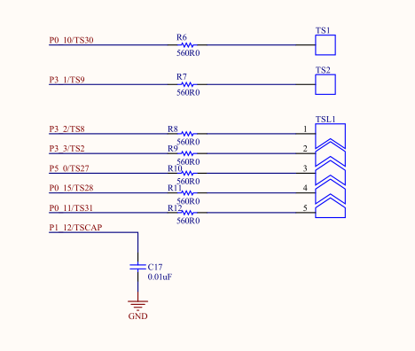
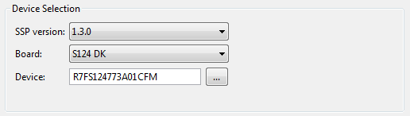
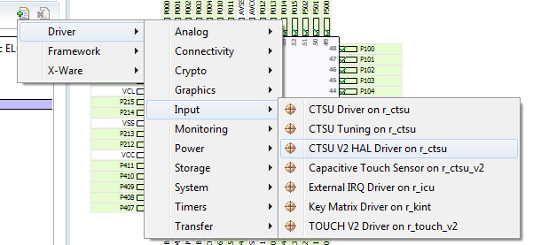
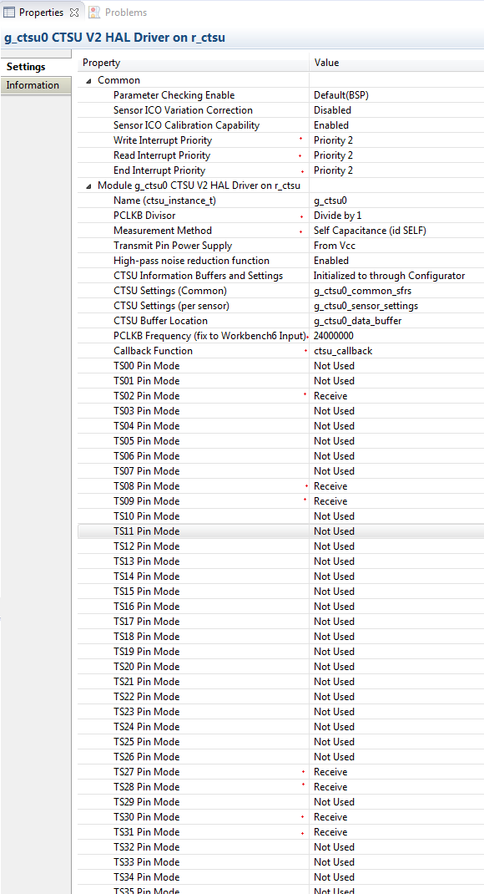
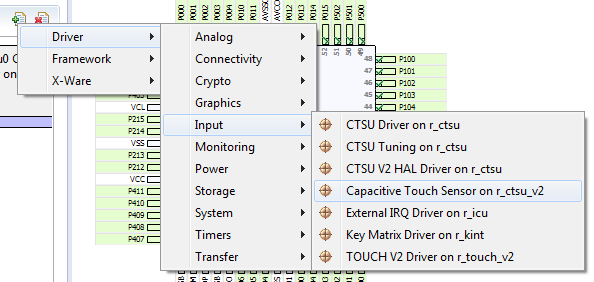
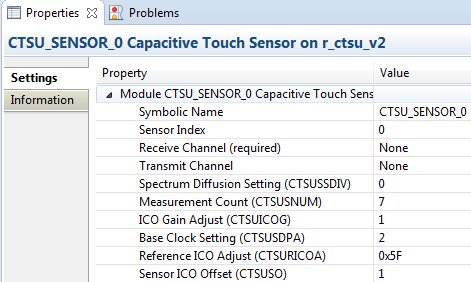
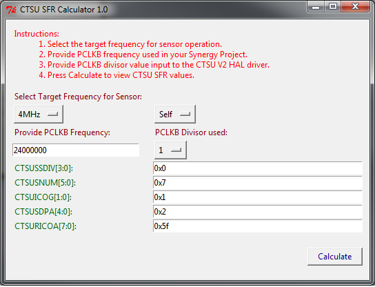

---
title: 
- type: main
  text: Application Note
- type: subtitle
  text: Capacitive Touch Detection with DK-S124
author: Renesas Electronics America (Applications Engineering Group)
date: 2017-11-01
cover-image:
...

# Introduction #
This application note is designed to educate a user on using the capacitive touch sensors available with the DK-S124. The following sections will 
describe how to configure, calibrate and operate the Capacitive Touch Sensing Unit hardware on-board the microcontroller to measure changing capacitance. 
When the CTSU is capable of measurements, the Touch Detection Middle-ware is used to monitor the measurements and indicate when a user input (due to close
proximity) to a touch sensor occurs.

## Equipment ##
The following harwdare and software is needed to work with this application note. Installation procedure for the software items below is available in the appendix 
and must be completed prior to evaluating further sections.
- DK-S124 (with USB Cable)
- e2studio ISDE (5.4.0.018+)
- Synergy Software Package v1.3.0+
- [Renesas.r_ctsu_v2.1.3.0.pack](http://www.google.com)
- [Renesas.r_touch_v2.1.3.0.pack](http://www.google.com)

# DK-S124 #
The S124 Development Kit (DK-S124) allows users to evaluate the Synergy S124 Microcontroller and develop their own applications. One of the features
available with the microcontroller is the Capacitive Touch Sensing Unit. This peripheral allows an application to detect changes in capacitance on
pins dedicated as Touch Sensing (TS) pins. A maximum of 36 such pins may be available with a Synergy microcontroller. The DK-S124 uses seven TS pins
in self-capacitance mode of operation. The schematic provided with the DK-S124 illustrates the pins used as TS pins.



As seen above, an additional pin **TSCAP is necessary**. The capacitance on this pin must be **fixed to 10nF**.

The SSP supports the DK-S124. As a result, when using the DK-S124; you should be able to select the kit when creating a new project, as shown in the mage below.



Follow the procedure in the appendix to create a new Synergy C Project (for the DK-S124) with just the Board Support Package.

# Configuring the Capacitive Touch Sensing Unit #
To properly set up the capacitive touch sensing unit the following steps must be followed:
1. Set up the I/O port as CTSU TS pins.
2. Set up the CTSU V2 HAL Driver.
3. Set up each Capacitive Touch Sensor information.

## I/O ports as CTSU TS pins ##
Most microcontrollers multiplex different peripheral pin capabilities on a single input/output port pin. The S124 is no different.
To setup the CTSU pins:
1. Open the SSP Configuration Perspective in e2studio using the menu *Window > Perspective > Other Perspectives > Other*
2. Open configuration.xml by double clicking on it in the Project Explorer.
3. Browse to the CTSU using *Pins (tab) > Pin Selection Column > Peripherals > Input: CTSU > CTSU*
4. When working with your own project, you have to setup the TS pins. If the DK-S124 was selected as the BSP, the pins used should be pre-configured.

[Example pins setup for DK-S124](./images/PIN_DKS124.PNG)

## CTSU V2 HAL Driver ##
The CTSU HAL Driver allows users to operate the peripheral. It should be introduced into a project using the following procedure:
1. Select the Threads tab in the SSP Configurator and select the HAL/Common under the Threads column.
2. Select Add Stacks for the HAL/Common stacks and use *Driver > Input > CTSU V2 HAL Driver on r_ctsu* to add the driver onto the stack.
3. Select the instance g_ctsu0 in the HAL/Common stacks column and use the Properties tab view to modify the following properties from default value to the values shown below:
	- **Write/Read/End Interrupt Priority**: 2 (Do not select priority of 0 for the CTSU).
	- **PCLKB Divisor**: 1 (A higher value should be used when PCLKB frequencies higher than 32MHz are used).
	- **Measurement method**: Self Capacitance (This is because the DK-S124 hardware layout is for self-capacitance sensors).
	- **PCLKB Frequency**: 24000000 (This value must match the PCLKB setting made in the SSP Configurator Clock tab).
	- **Callback Function**: ctsu_callback (This function of type ```void (*)(ctsu_callback_arg_t * p_arg)``` is called when a CTSU event occurs).
	- **TSxx Pin mode**: Receive (Repeat this for the following pins)
		+ TS02
		+ TS08
		+ TS09
		+ TS27
		+ TS28
		+ TS30
		+ TS31



The fully configured driver is as shown below:



## Capacitive Touch Sensor information ##
The DK-S124 uses seven sensors. Each sensor can be driven with an independent waveform. Therefore, seven Capacitive Touch Sensors must 
be created and the information for each sensor's waveform must be input (as the CTSU SFRs).
The sensors are fairly low capacitance and can be driven with a 4MHz frequency. 
The sub-sections below illustrate how to add and configure each sensor.

### Adding a sensor ###
1. Use the HAL/Common Stacks Add Stack > Driver > Input > Capacitive Touch Sensor on r_ctsu_v2 to add a sensor.
2. Right click on the dependency Add CTSU HAL driver and select Use > g_ctsu0 CTSU V2 HAL Driver on r_ctsu. This will pick the settings we made in the previous sub section.
3. Select the Receive Channel. 




Note: ensure that the sensors follow the exact index order shown below
	- Index 0: TS02
	- Index 1: TS08
	- Index 2: TS09
	- Index 3: TS27
	- Index 4: TS28
	- Index 5: TS30
	- Index 6: TS31

### Configuring sensor frequency ###
Setup the CTSU SFRs for each Capacitive Touch Sensor with the settings below to generate a 4MHz waveform from each TS pin. 
- CTSUSSDIV - 0x0
- CTSUSNUM  - 0x7
- CTSUICOG  - 0x1
- CTSUSDPA  - 0x2
- CTSURICOA - 0x5F
- CTSUSO	- 0x1



The settings above take into account the PCLKB frequency generated by the Clock Generation Circuit, mode of operation, and
the PCLKB divisor in the CTSU. Choosing a different frequency, mode of operation and divisor will result in different values.
You may run the `ctsu_sfr_calculator.py` under the `${ProjName}\synergy\r_ctsu_v2\tools` folder to assist in this task.



The only non-calibrated value after this step is the CTSUSO value. The CTSU Calibrate functionality show allow estimating the value for this i.e. calibration.

# Calibrating the CTSU Sensor Offset Register #

After the CTSU V2 HAL Driver and Capacitive Touch Sensors on r_ctsu_v2 have been configured use the Generate Project Content button in the SSP Configurator 
to generate the relevaant source code.

## Estimating CTSUSO ##

Open `src\hal_entry.c`; replace with the code snippet shown below; Build, and Start the Debugger. The output of the printf should be visible in the 

```c
    
    #include <stdio.h>
    #include "hal_data.h"

    #define SHOW_SENSOR_INFORMATION

    void hal_entry(void)
    {
        extern void initialise_monitor_handles(void);

        initialise_monitor_handles();

        ctsu_err_t err = CTSU_SUCCESS;
        err = g_ctsu0.p_api->open(g_ctsu0.p_ctrl, g_ctsu0.p_cfg);

        while(CTSU_SUCCESS != err)
        {
            ;
        }

    #if defined(SHOW_SENSOR_INFORMATION)
        ctsu_control_arg_t arg;
        uint16_t        num_sensors = 0;
        arg.p_context = &num_sensors;
        arg.cmd = CTSU_CMD_GET_SENSOR_COUNT;
        err = g_ctsu0.p_api->control(g_ctsu0.p_ctrl, &arg);

        while(CTSU_SUCCESS != err)
        {
            ;
        }

        printf("Pre Calibration values:");

        for(uint32_t itr = 0; itr < num_sensors; itr++)
        {
            uint16_t ctsuso0 = g_ctsu0.p_cfg->p_sensor_settings[itr].ctsuso0;

            printf("ctsuso0=0x%x; ctsuso=0x%x\r\n", ctsuso0, (ctsuso0 & 0x3FF));
        }
    #endif

        err = g_ctsu0.p_api->calibrate(g_ctsu0.p_ctrl);

    #if defined(SHOW_SENSOR_INFORMATION)
        printf("Post Calibration values:");
        for(uint32_t itr = 0; itr < num_sensors; itr++)
        {
            uint16_t ctsuso0 = g_ctsu0.p_cfg->p_sensor_settings[itr].ctsuso0;
            uint16_t ctsuso  = (ctsuso0 & 0x3FF);
            printf("ctsuso0=0x%x; ctsuso=0x%x\n\r", ctsuso0, ctsuso);

            if((ctsuso >= 0x3FE) || (ctsuso <= 0x1))
            {
                printf("Sensor %d may be unstable, consider changing operation frequency to 4,2,1, or 0.5 MHz\n\r", itr);
            }
        }
    #endif

        while(CTSU_SUCCESS != err)
        {
            ;
        }

        err = g_ctsu0.p_api->close(g_ctsu0.p_ctrl);

        return;
    }
    
    /* 
     * This function must be provided the the HAL driver as the callback.
     * You may observe ICOMP errors if the delay is not executed the first 
     * time a scan occurs. It is most likely due to the CTSU driving the 
     * TS pins before the TSCAP fully charges.
     */
    void ctsu_callback(ctsu_callback_arg_t * p_arg)
    {
        if(p_arg->event_mask==CTSU_EVENT_SFRS_CHANGED)
        {
            R_BSP_SoftwareDelay(10, BSP_DELAY_UNITS_MILLISECONDS);
        }
    }
	
```

In the Virtual Debug Console you should observe an output similiar to the one shown below:

```c

    Pre Calibration values:
    ctsuso0=0x1c01; ctsuso=0x1
    ctsuso0=0x1c01; ctsuso=0x1
    ctsuso0=0x1c01; ctsuso=0x1
    ctsuso0=0x1c01; ctsuso=0x1
    ctsuso0=0x1c01; ctsuso=0x1
    ctsuso0=0x1c01; ctsuso=0x1
    ctsuso0=0x1c01; ctsuso=0x1
    Post Calibration values:
    ctsuso0=0x1d47; ctsuso=0x147
    ctsuso0=0x1d58; ctsuso=0x158
    ctsuso0=0x1d8a; ctsuso=0x18a
    ctsuso0=0x1d07; ctsuso=0x107
    ctsuso0=0x1d0f; ctsuso=0x10f
    ctsuso0=0x1e08; ctsuso=0x208
    ctsuso0=0x1db8; ctsuso=0x1b8

```

## Finalizing CTSUSO ##
Use the SSP Configurator to replace the CTSUSO values based on the output shown in the Virtual Debug Console.

So, Capacitive Touch Sensor with :
- index 0 and TS02 as receive pin should have CTSUSO as 0x147
- index 1 and TS08 as receive pin should have CTSUSO as 0x158
- index 2 and TS09 as receive pin should have CTSUSO as 0x18a
- index 3 and TS27 as receive pin should have CTSUSO as 0x107
- index 4 and TS28 as receive pin should have CTSUSO as 0x10f
- index 5 and TS30 as receive pin should have CTSUSO as 0x208
- index 6 and TS31 as receive pin should have CTSUSO as 0x1b8

Generate and Build the project and Download values to the MCU. You will observe that calibration now completes much quicker.

## Observing CTSU measurements ##
Use the steps below to observe measurements made by the CTSU.
- Copy the variable name assigned to the CTSU Buffer Location i.e. `g_ctsu0_data_buffer`.
- Open the **Expressions** tab in e2studio.
- Add a `g_ctsu0_data_buffer` to the expressions tab and use the options available on right click to enable real time measurements
- Observe the increase in the even indexes of g_ctsu0_data_buffer when a sensor is touched. This value is the sensor counter value **CTSUSC** for each Sensor.
- The odd indexes of g_ctsu0_data_buffer are the reference counter values **CTSURC** for each sensor.

The Real-time Chart tab view may also be used to visually observe the operation of the CTSU. 
It must be noted that the CTSUSC value returns to the CTSURC value when the sensor is no longer touched.

# TOUCH Detection #
Once the CTSU is configured and calibrated, the microcontroller is ready to perform touch detection. 
The CTSU V2 HAL Driver is responsible for generating measurements whereas the TOUCH layer is responsible for maintaining a history to detect sudden changes in capacitance.
These sudden changes are identified as a touch or release.
The sections below outline steps to get a functional touch detection system.

## Add/Configure the TOUCH V2 Driver ##
- Use the SSP Configurator and use *New Stacks > Driver > Input > TOUCH V2 Driver on r_touch_v2*.
- Click on the dependency Add CTSU HAL Driver and select *Use > g_ctsu0 CTSU V2 HAL Driver on r_ctsu* to select the previously configured CTSU V2 HAL Driver.
- Use the Properties tab to change the parameters below
	+ Callback Function :`touch_callback`. (This function of type ```void (*)(touch_callback_arg_t * p_arg)``` is called when a TOUCH event occurs).
	
## Configure TOUCH DETECTION PARAMETERS ## 
Use the SSP Configurator to change the parameters for each Capacitive Touch Sensor previously configured in the HAL/Common stack.
- Touch Threshold  : 2000  (This is the difference in sensor count from the baseline average, beyond which a sensor is assumed to be touched).
- Touch Hysteresis : 100   (The sensor counter must fall below the threshold by the value in this field to trigger a release from touch).
- Delay-To-Touch   : 3     (The sensor counter must remain above the threshold for the amount specified in this field consecutively before the sensor is assumed touched )
- Delay-To-Touch   : 3     (The sensor counter must remain below the `(threshold - hystersis)` value for the amount specified in this field consecutively before the sensor is assumed released )

## Calibrating the TOUCH V2 Driver ##
Replace the code in `${ProjName}\src\hal_entry` with snippet below.

```c
	void hal_entry(void)
	{
		extern void initialise_monitor_handles(void);

		initialise_monitor_handles();

		touch_err_t err = TOUCH_SUCCESS;
		err = g_touch0.p_api->open(g_touch0.p_ctrl, g_touch0.p_cfg);

		while(TOUCH_SUCCESS != err)
		{
			;
		}
		
		err = g_touch0.p_api->calibrate(g_touch0.p_ctrl);
		 while(TOUCH_SUCCESS != err)
		{
			;
		}

		g_touch0.p_api->read(g_touch0.p_ctrl, &read_args);

		while(1)
		{
			if(g_touch0.p_api->update(g_touch0.p_ctrl)==TOUCH_SUCCESS)
			{
				g_touch0.p_api->scan(g_touch0.p_ctrl);
				R_BSP_SoftwareDelay(10, BSP_DELAY_UNITS_MILLISECONDS);
			}

		}

		err = g_touch0.p_api->close(g_touch0.p_ctrl);

		return;
	}
	
	void touch_callback(touch_callback_arg_t * p_arg)
	{
		if (TOUCH_EVENT_REQUEST_DELAY == p_arg->event)
		{
			R_BSP_SoftwareDelay(10, BSP_DELAY_UNITS_MILLISECONDS);
		}
	}
```

## Observing Touch Detection ##
- Copy the name of the Binary result buffer (g_touch0_binary) from the g_touch0 TOUCH V2 Driver on r_touch_v2.
- Add `g_touch0_binary` to the Expressions tab and enable Real-time Refresh.
- Touch the sensors on the DK-S124 and observe the binary changing values.

# Appendix #

## Installation ##
From the Synergy Gallery:

1. Install the e2studio Integrate Solution Development Environment. Note the installation path.
2. Install the Synergy Software Package v1.3.0; or later versions. You may have to provide the installation path from step 1.
3. Copy the downloaded CTSU and TOUCH v2.00 pack files to the `internal\projectgen\arm\Packs` folder in e2studio.

## Creating a New Synergy C Project ##

## References ##
Synergy Gallery
DK-S124 Schematic
